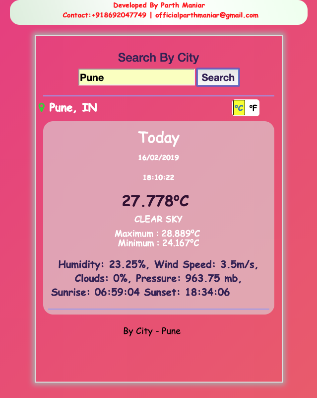

# AmalgamationOfWeather

Amalgamation of Weather Forecast (Rainfall, Precipitation, Humidity,
Temperature & other standard weather parameters) from multiple free public data
streams & APIs (Open Weather, ForecastIo, Weather Underground,
Aeris-weather, Open-weather Map etc.& many more. A more detailed list can be
furnished later) & amalgamate these through some statistical averaging to produce a
single integrated weather forecast stream for a particular geo location within a 2 Km
radius. We would like to provide this information on our App & also publish an API if
possible.

## Features 

- Amalgamated Data: Data is merged from different APIs.
- Dynamic Content: Content is updated with given time interval.
- Search By City

### Screens

#### By Current Location: &nbsp; &nbsp; &nbsp;&nbsp;&nbsp;&nbsp;&nbsp;&nbsp;&nbsp;&nbsp;&nbsp;&nbsp;&nbsp;&nbsp;&nbsp;&nbsp;&nbsp;&nbsp;&nbsp;&nbsp;&nbsp;&nbsp;&nbsp;&nbsp;&nbsp;&nbsp;&nbsp;&nbsp;&nbsp;&nbsp;&nbsp;&nbsp;&nbsp;&nbsp;&nbsp;&nbsp;&nbsp;&nbsp;&nbsp;&nbsp;&nbsp;&nbsp;&nbsp;&nbsp;&nbsp;&nbsp;&nbsp;&nbsp;&nbsp;&nbsp;&nbsp;By City:

   

---

### Live 

[Live Preview Of Project] 

Note: Results may show NaN values due to API key failure.

[Live Preview Of Project]: https://officialpm.github.io/AmalgamationOfWeather/
